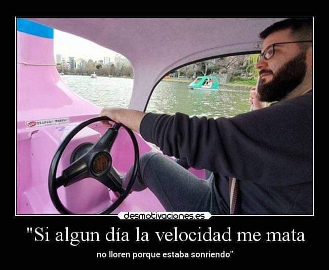

# add1920-ruben
Trabajos de ADD
* ejemplo de trabajo
* otro ejemplo
* otro más

Si la velocidad me mata, que nadie llore, estaba sonriendo.

> Velocidad= distancia/tiempo

Ojalá me mate de una vez:

```
git clone

```

