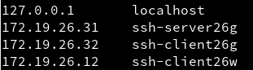
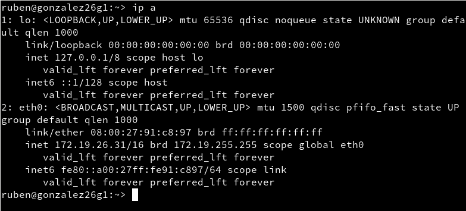
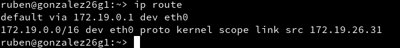
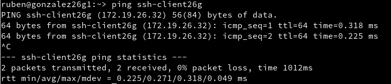
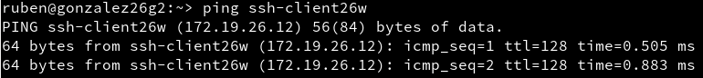
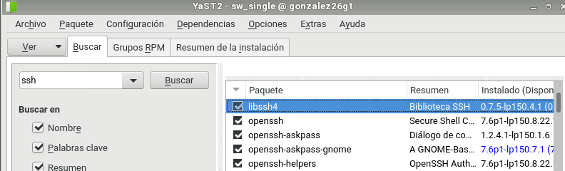
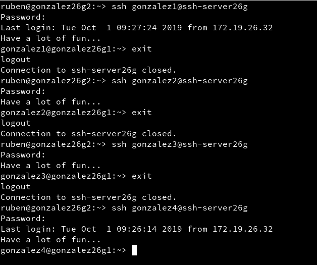

# Servidor SSH
## Preparativos en Servidor OpenSUSE
Para empezar esta actividad, configuraremos una máquina OpenSUSE que va a actuar como servidor.
Le asignamos el nombre **ssh-serverXXg**, ponemos la contraseña que deseemos al usuario *root* y por último, añadimos en el fichero */etc/hosts* a los usuarios *ssh-clientXXg* (que será una máquina OpenSUSE que actuará como ciente) y *ssh-clientXXw* (que será una máquina Windows que actuará tambien como cliente).

Pero antes debemos haber creado dichas máquinas y configurado sus respectivas IP's de la siguiente manera.

(Imagen de los hosts ya incluidos en el fichero)

Para comprobar que hemos configurado esta máquina ejecutaremos los siguientes comandos:

A continuación crearemos los siguientes usuarios en la máquina en la que nos encontramos actualmente, es decir: *ssh-serverXXg*.

* primer-apellido1

* primer-apellido2

* primer-apellido3

* primer-apellido4

## Preparativos en Cliente OpenSUSE

Configuramos este cliente GNU/Linux asignándole el nombre "*ssh-clientXXg*" y añadiendo en su archivo **/etc/hosts** al equipo *ssh-serverXXg* y al equipo *ssh-clientXXw*.

Para comprobar que hay conexión entre las máquinas podemos usar el comando *ping* con sus IP's:

## Preparativos en Cliente Windows

Primero debemos instalar el software cliente SSH en esta máquina Windows, como en este caso, **PuTTY**.

Luego, le asignaremos el nombre a la máquina: *ssh-clientXXw* y añadiremos las máquinas *ssh-serverXXg* y *ssh-clientXXg* al fichero *C:\Windows\System32\drivers\etc\hosts*.

En esta máquina también podremos hacer **ping** para comprobar las conexiones.

## Instalación del Servicio SSH

Para instalar el servicio SSH en la máquina de OpenSUSE que usaremos como servidor, podremos instalarlo por entorno gráfico o por comandos.

Para descargarlo por entorno gráfico tenemos que abrir la herramienta *yast*, seleccionar *Instalar Software*, buscar *ssh* e instalarlo.

Por comandos tendriamos que ejecutar *zypper install openssh*.

Cuando lo hayamos instalado y querramos saber si el servicio está activo, ejecutaremos en el terminal el comando **systemctl status sshd**.

En caso de que no esté activo, lo podremos activar usando el comando **systemctl enable sshd**.

Ejecutamos el comando *sudo lsof -i:22 -n* para comprobar que el servicio está escuchando por el puerto 22.

## Primera coneción SSH desde el cliente GNU/Linux

Vamos al cliente de OpenSUSE (máquina *ssh-clientXXg*).

Usamos el comando *nmap -Pn ssh-serverXXg* para comprobar los puertos abiertos en el servidor. Esto debe mostrar que el puerto 22 está abierto.
>Si no es así, debemos comprobar la configuración del cortafuegos en la máquina servidor.

Vamos a comprobar el funcionamiento de la conexión SSH desde cada cliente usando el usuario **primer-apellido1**.

Desde esta máquina cliente, nos conectaremos mediante *ssh primer-apellido1@ssh-serverXXg*.

Si nos conectamos una segunda vez, obtendremos lo siguiente:

Comprobar contenido del fichero *$HOME/.ssh/known_hosts* en el equipo *ssh-client1*. OJO si el prompt pone *ssh-server* están el el servidor, y si pone *ssh-clientXXg* están el el cliente GNU/Linux.

Ahora comprobaremos que funcionan correctamente las conexiones SSH desde el cliente.

## Primera conexión desde cliente Windows

Nos conectamos usando **PuTTY**.

* No usar Save Settings para guardar la configuración de la conexión SSH en los perfiles de PuTTY.
* En la ventana PuTTY Security Alert, poner que SI grabar las información del servidor.

Si hemos llegado hasta aquí, deberían funcionar el resto de conexiones.

## Cambiamos la identidad del servidor

Confirmar que existen los siguientes ficheros en */etc/ssh*, Los ficheros *ssh_host*key* y *ssh_host*key.pub*, son ficheros de clave pública/privada que identifican a nuestro servidor frente a nuestros clientes:

