# **1. Servidor SSH**
## 1.1 Preparativos en Servidor OpenSUSE
Para empezar esta actividad, configuraremos una máquina OpenSUSE que va a actuar como servidor.
Le asignamos el nombre **ssh-serverXXg**, ponemos la contraseña que deseemos al usuario *root* y por último, añadimos en el fichero */etc/hosts* a los usuarios *ssh-clientXXg* (que será una máquina OpenSUSE que actuará como ciente) y *ssh-clientXXw* (que será una máquina Windows que actuará tambien como cliente).

Pero antes debemos haber creado dichas máquinas y configurado sus respectivas IP's de la siguiente manera.


(Imagen de los hosts ya incluidos en el fichero)

Para comprobar que hemos configurado esta máquina ejecutaremos los siguientes comandos:


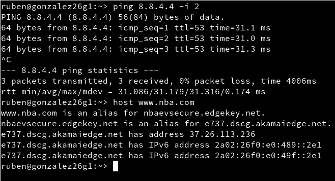


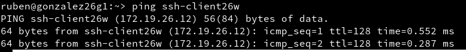


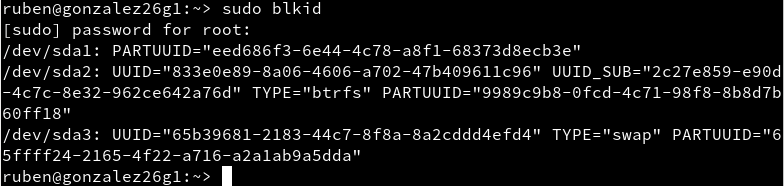

A continuación crearemos los siguientes usuarios en la máquina en la que nos encontramos actualmente, es decir: *ssh-serverXXg*.

* primer-apellido1

* primer-apellido2

* primer-apellido3

* primer-apellido4

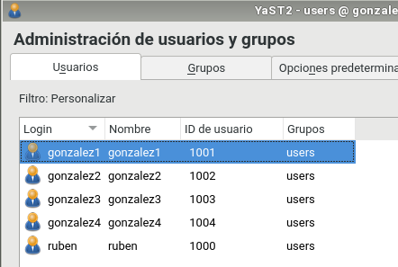

## 1.2 Preparativos en Cliente GNU/Linux

Configuramos este cliente GNU/Linux asignándole el nombre "*ssh-clientXXg*" y añadiendo en su archivo **/etc/hosts** al equipo *ssh-serverXXg* y al equipo *ssh-clientXXw*.

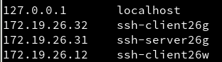

Para comprobar que hay conexión entre las máquinas podemos usar el comando *ping* con sus IP's:

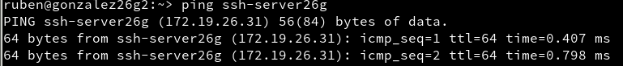


## 1.3 Preparativos en Cliente Windows

Primero debemos instalar el software cliente SSH en esta máquina Windows, como en este caso, **PuTTY**.


Luego, le asignaremos el nombre a la máquina: *ssh-clientXXw* y añadiremos las máquinas *ssh-serverXXg* y *ssh-clientXXg* al fichero *C:\Windows\System32\drivers\etc\hosts*.


En esta máquina también podremos hacer **ping** para comprobar las conexiones.

# **2. Instalación del Servicio SSH**

Para instalar el servicio SSH en la máquina de OpenSUSE que usaremos como servidor, podremos instalarlo por entorno gráfico o por comandos.

Para descargarlo por entorno gráfico tenemos que abrir la herramienta *yast*, seleccionar *Instalar Software*, buscar *ssh* e instalarlo.


Por comandos tendriamos que ejecutar *zypper install openssh*.

## 2.1 Comprobación
Cuando lo hayamos instalado y querramos saber si el servicio está activo, ejecutaremos en el terminal el comando **systemctl status sshd**.

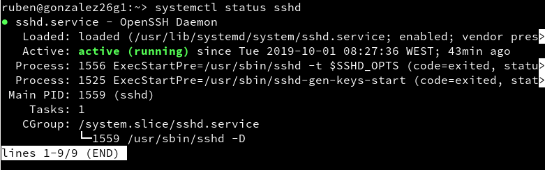

En caso de que no esté activo, lo podremos activar usando el comando **systemctl enable sshd**.

Ejecutamos el comando *sudo lsof -i:22 -n* para comprobar que el servicio está escuchando por el puerto 22.

## 2.2 Primera conexión SSH desde el cliente GNU/Linux

Vamos al cliente de OpenSUSE (máquina *ssh-clientXXg*).

Usamos el comando *nmap -Pn ssh-serverXXg* para comprobar los puertos abiertos en el servidor. Esto debe mostrar que el puerto 22 está abierto.
>Si no es así, debemos comprobar la configuración del cortafuegos en la máquina servidor.

Vamos a comprobar el funcionamiento de la conexión SSH desde cada cliente usando el usuario **primer-apellido1**.

Desde esta máquina cliente, nos conectaremos mediante *ssh primer-apellido1@ssh-serverXXg*.

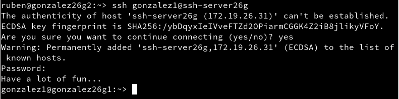

Si nos conectamos una segunda vez, obtendremos lo siguiente:

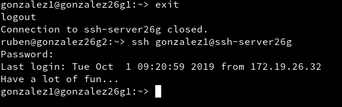

Comprobar contenido del fichero *$HOME/.ssh/known_hosts* en el equipo *ssh-client1*. OJO si el prompt pone *ssh-server* están el el servidor, y si pone *ssh-clientXXg* están el el cliente GNU/Linux.

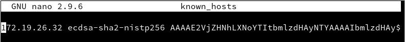

Ahora comprobaremos que funcionan correctamente las conexiones SSH desde el cliente.


## 2.3 Primera conexión desde cliente Windows

Nos conectamos usando **PuTTY**.

* No usar Save Settings para guardar la configuración de la conexión SSH en los perfiles de PuTTY.
* En la ventana PuTTY Security Alert, poner que SI grabar las información del servidor.


Si hemos llegado hasta aquí, deberían funcionar el resto de conexiones.

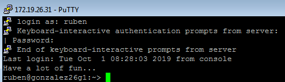

# **3. Cambiamos la identidad del servidor**

Confirmar que existen los siguientes ficheros en */etc/ssh*, Los ficheros *ssh_host*key* y *ssh_host*key.pub*, son ficheros de clave pública/privada que identifican a nuestro servidor frente a nuestros clientes:

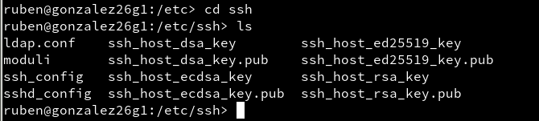

Modificamos el fichero de configuración **SSH** *(/etc/ssh/sshd_config)* para añadir la línea *Hostkey /etc/ssh/ssh_host_rsa_key*. También comentar el resto de líneas (usando **#**) con configuración HostKey. Este parámetro define los ficheros de clave publica/privada que van a identificar a nuestro servidor. Con este cambio decimos que sólo vamos a usar las claves del tipo RSA.

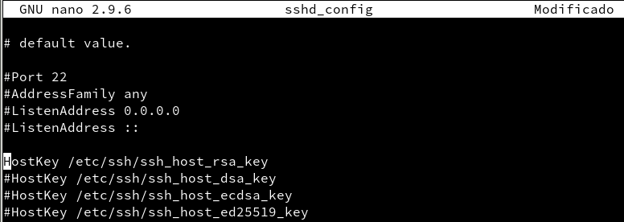

## 3.1 Regenerar cartificados

Ahora, en la máquina **ssh-serverXXg**, cambiaremos o volveremos  generar nuevas claves públicas/privadas para la identificación de nuestro servidor.

>Usar comando *ssh-keygen -t rsa -f /etc/ssh/ssh_host_rsa_key*.

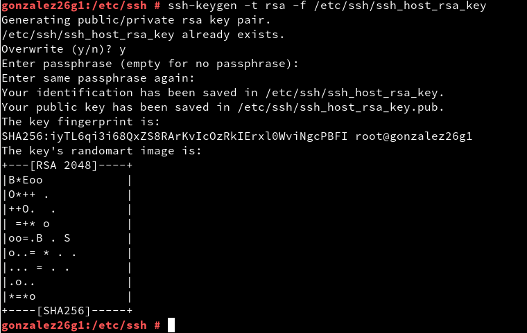

Reiniciamos el servicio SSH usando el comando *systemctl restart sshd* y comprobamos que el servicio está activo con el comando *systemctl status sshd*.

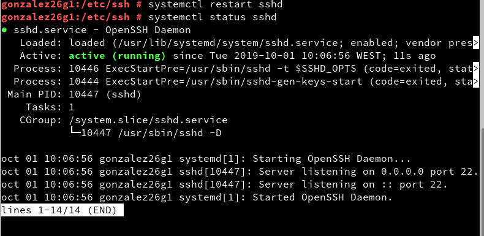

## 3.2 Comprobamos

Comprobamos qué es lo que sucede cuando volvemos a intentar conectarnos desde los dos clientes **primer-apellido2** y **primer-apellido1**.

Da error.

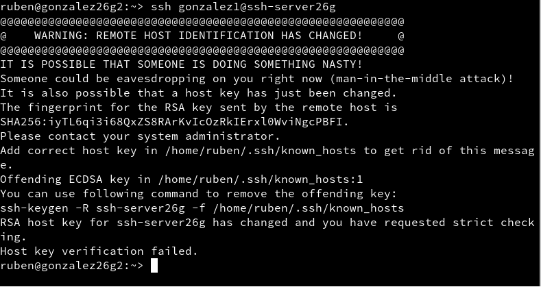

>Para solucionar el error, debemos leer el mensaje que nos ha salido al ejecutar el comando, ahí está todo lo necesario.

Una vez arreglado, nos podremos conectar.

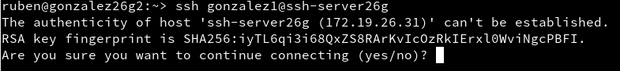

# **4. Personalización del prompt Bash**

Podremos personalizarlo añadiendo las siguientes líneas al fichero de configuración del usuario **primer-apellido1** en la máquina sevidor *ssh-serverXXg*.

>Fichero a editar: */home/primer-apellido1/.bashrc*.

Añadimos las siguientes líneas:
```
# Se cambia el prompt al conectarse vía SSH

if [ -n "$SSH_CLIENT" ]; then
   PS1="AccesoRemoto_\e[32m\u@\h:\e[0m \w\a\$ "
else
   PS1="\[$(pwd)\]\u@\h:\w>"
fi
```

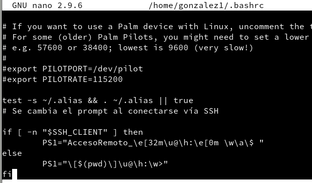

Tambien podemos crear el siguiente fichero para crear alias y así poder ejecutar comandos de una forma más sencilla y cómoda como si fueran "comados atajo".

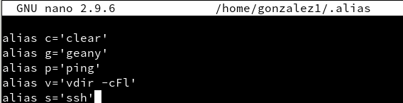

Comprobamos que las conexiones SSH funcionan.


Y también funcionan los alias que hemos asignaso a los comandos tanto en las máquinas OpenSUSE como en la Windows.


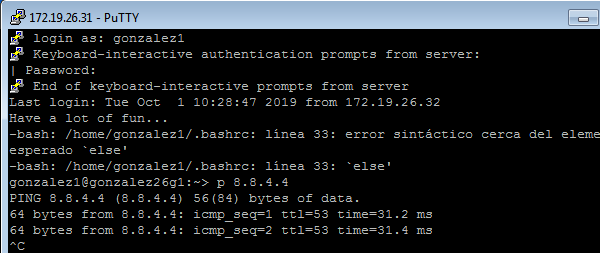

# **5. Autenticación mediante claves públicas**

En la máquina cliente de OpenSUSE (*ssh-clientXXg*), iniciamos sesión como nuestro **usuario normal** y ejecutamos el comando *ssh-keygen -t rsa* para generar un nuevo par de claves para el usuario en:

  * /home/nombre-alumno/.ssh/id_rsa
  * /home/nombre-alumno/.ssh/id_rsa.pub


Ahora vamos a copiar la clave pública (*id_rsa.pub*), al fichero "*authorized_keys*" del usuario remoto **primer-apellido4** que está definido en el servidor.

>Para ello podremos usar el comando *ssh-copy-id primer-apellido4@ssh-serverXXg*.

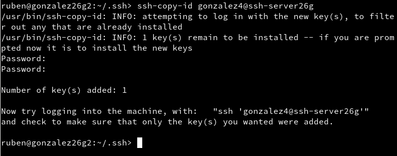

Podemos comprobar que desde la máquina *ssh-clientXXg*, **NO** se pide password, mientras que en la máquina *ssh-clientXXw* **SI** se pide.

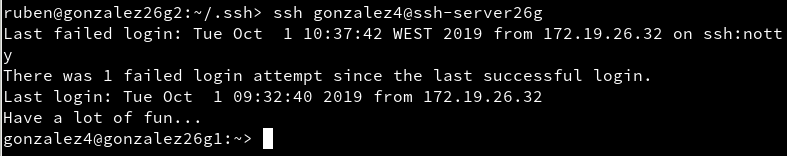


# **6. Uso de SSH como túnel para X**

En la máquina OpenSUSE que usamos como servidor, instalamos una aplicación de entorno gráfico.

>En mi caso desintalo el Geany de la máquina cliente para así tenerla solo en la máquina servidor.

Modificaremos el servidor SSH para permitir la ejecución de aplicaciones gráficas, desde los clientes.

Para ello, nos dirigimos al fichero de configuración */etc/ssh/sshd_config* (Opción *X11Forwarding yes* **OJO**, sin poner la almohadilla).

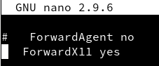

Y recargamos el servicio SSH para que se guarden los cambios de configuración.

Ahora vamos a la máquina cliente de OpenSUSE.

Ejecutamos el comando *zypper se NOMBRE-DE-APLICACION*, para comprobar que dicha aplicación no está instalada.


Desde esta misma máquina, vamos a comprobar que funciona la aplicación del servidor por vía remota:

Ejecutamos el comando *ssh -X primer-apellido1@ssh-serverXXg* y ejecutamos la aplicación.


# **7. Aplicaciones Windows nativas**

Instalaremos el emulador *Wine* en el *ssh-serverXXg*.

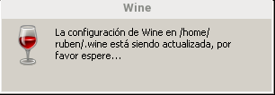

Ahora podemos instalar alguna aplicación de Windows en el servidor SSH usando este emulador. O también podemos usar el Block de Notas que viene con el Wine: **wine notepad**.

Comprobar que la plicación funciona correctamente en las máquinas OpenSUSE.


# **8.Restricciones de uso**

Vamos a modificar los usuarios del servidor SSH para añadir algunas restricciones de uso del servicio.

## 8.1 Restricción sobre un usuario

Vamos a crear una restricción de uso del SSH para un usuario, por ejemplo el usuario *primer-apellido2*.

Modificamos el fichero de configuración del servidor SSH (*/etc/ssh/sshd_config*) para restringir el acceso al usuario. Consultamos las opciones *AllowUsers* y *DenyUsers*, pero como solo vamos a bloquear el acceso a un usuario, solo modificaremosla segunda opción.


Comprobamos que no se puede acceder al servicio SSH con el usuario *primer-apellido2*.

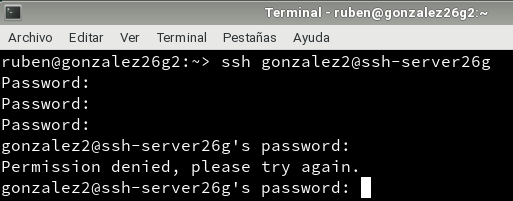

## 8.2 Restricción sobre una aplicación

Primero crearemos un grupo de usuarios al que llamaremos **remoteapps** y metemos en ese grupo al usuario *primer-apellido4*.

Ponemos al programa que queramos el grupo propietario *remoteapps* y le asignamos los permisos del ejecutable del programa a 750. De esta forma, los usuarios que no pertenezcan a este grupo no podrán ejecutar el programa.
