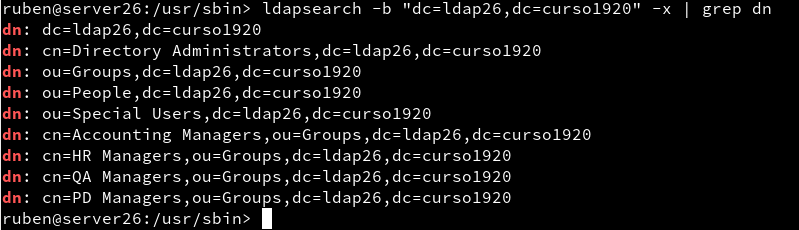

# **Servicio de Directorio con comandos**

## (2.3) Comprobación del contenido del DS LDAP

## (3.3) Comprobación del nuevo usuario

## (4.3) Comprobación de los usuarios creados

>(El comando muestra más contenido del que aparece en la captura, enseñando los otros 3 usuarios creados.)
