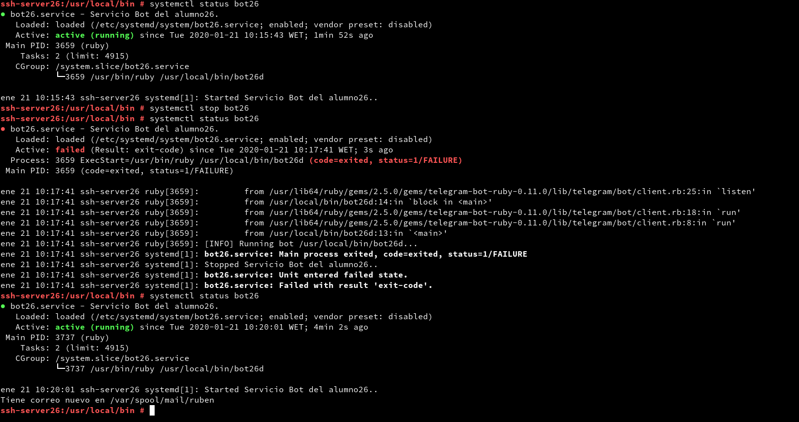

# **Servicio de comunicaciones con Telegram (bot-service)**

## **Script del bot**

```ruby
#!/usr/bin/env ruby

require 'telegram/bot'

# token:
# 1. Write your TOKEN value into "token" variable or
# 2. Create a local file "hiden.token" with your TOKEN value inside
token = `cat /etc/bot26/token`.strip
bot_username = '@ruben26_bot'

puts "[INFO] Running bot #{$0}..."

Telegram::Bot::Client.run(token) do |bot|
  bot.listen do |message|
    puts " => #{message.text}"

    if message.text == "/start"
      bot.api.send_message(chat_id: message.chat.id, text: "¡Hola! Soy un bot creado por Rubén para una actividad de la asignatura *Administración de Sistemas Operativos*.
Si quiere ver los comandos disponibles escriba */help*.")
    elsif message.text == "/help"
      bot.api.send_message(chat_id: message.chat.id, text: "Lista de comandos implementados en el bot:

/hola - Responde con un saludo

/adios - Se despide

/ping - Dice si hay conexión a Internet y muestra el tiempo de respuesta

/ip - Muestra la ip asignada al dispositivo

/storage - Muestra como está organizado el espacio del disco

(OJO, si está desde un dispositivo móvil, es posible que necesite girar el móvil para visualizar bien algunos comandos.)")

    elsif message.text == "/hola"
      bot.api.send_message(chat_id: message.chat.id, text: "¡Hola!")
    elsif message.text == "/adios"
      bot.api.send_message(chat_id: message.chat.id, text: "¡Hasta luego!")
    elsif message.text == "/ping"
      ms = `ping 8.8.4.4 -c1 | grep icmp | grep time`
      if ms == 0
        bot.api.send_message(chat_id: message.chat.id, text: "El equipo no tiene conexión a Internet")
      elsif ms != 0
        bot.api.send_message(chat_id: message.chat.id, text: "El equipo tiene conexión a Internet y el tiempo de respuesta es de #{ms[-8,ms.size]}")
      end
    elsif message.text == "/storage"
      disks = `df -hT`
      bot.api.send_message(chat_id: message.chat.id, text: "El espacio del disco está siendo usado de la siguiente manera:
        #{disks[0,disks.size]}")
    elsif message.text == "/ip"
      ip = `ip a | grep scope | grep eth0`.split
      bot.api.send_message(chat_id: message.chat.id, text: "La ip es #{ip[1]}")
    end
  end
end

```

**URL del vídeo donde se muestra el bot en funcionamiento:** https://www.youtube.com/watch?v=0U2E62QY4x0

## **Iniciar y parar el servicio**

**Fichero de configuración del servicio:**

```
[Unit]
Description=Servicio Bot del alumno26.
After=network.service

[Service]
Type=simple
ExecStart=/usr/bin/ruby /usr/local/bin/bot26d

[Install]
WantedBy=multi-user.target

```

**Captura de comprobación:**


## **Tareas programadas**

Escribimos *crontab -e* para añadir una tarea programada, en este caso, haremos que el programa se inicie cada cinco minutos.


Y lo comprobamos controlando las horas que aparecen en el comando "systemctl status botXX".


