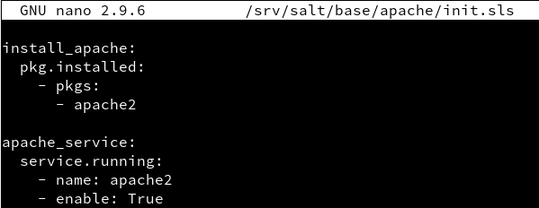
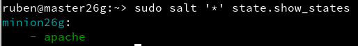
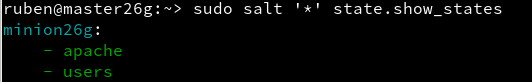

# **Salt-stack**

## **1.- Introducción**

Hay varias herramientas conocidas del tipo de gestor de infraestructura como Puppet, Chef y Ansible. En esta actividad vamos a practicar Salt-stack con OpenSUSE.

## **2.- Preparativos**

Configurar `/etc/hosts` con las siguientes IPs y nombres de host para las máquinas.

| Config   | MV1           | MV2          |
| -------- | ------------- | ------------ |
| Alias    | Master        | Minion       |
| Hostname | masterXXg     | minionXXg    |
| SO       | OpenSUSE      | OpenSUSE     |
| IP       | 172.19.XX.31  | 172.19.XX.32 |

>¡Ojo! "XX" es el número aignado a cada alumno.


## **3.- Máster: instalar y configurar**

Vamos a la máquina virtual 1 e instalamos el software del Máster.


Modificamos `/etc/salt/master` para configurar nuestro máster de la siguiente manera:


Ejecutamos los siguientes comandos:

`systemctl enable salt-master.service` para activar el servicio de arranque del sistema.


`systemctl start salt-master.service` para iniciarlo.


`salt-key -L` para consultar los minions aceptados, denegados, pendientes de aceptar o los rechazados.


## **4.- Minion**

>Los Minions son los equipos que van a estar bajo el control del Máster.

### **4.1.- Instalación y configuración**

Vamos a la máquina virtual 2.

Ejecutamos el siguiente comando para instalar el software del minion.


Ahora modificamos `etc/salt/minion` para definir quién será nuestro máster.


Ejecutamos `systemctl enable salt-minion.service` y `systemctl start salt-minion.service` para activar Minion en el arranque del sistema e iniciarlo.


Comprobamsoq ue no tenemos instalado `apache2` en el equipo (en caso de tenerlo instalado, desinstalarlo).


Volvemos a la máquina máster (MV1).

Nos aseguramos de que el cortafuegos permite las conexiones al servicio Salt.

Comnsultar URL [Opening the Firewall up for Salt](https://docs.saltstack.com/en/latest/topics/tutorials/firewall.html)


Volvemos a ejecutar el comando de comprobacion de los minions para ver si ha llegado la petición de nuestro minion y así poder aceptarla con el comando `sudo salt-key -a minionXXg`.
Volvemos a comprobar para ver la solicitud aceptada.


### **4.2.- Comprobamos conectividad**

Ejecutamos los siguientes comandos con permiso root para probar la conectividad entre el máster y el minion.


>El símbolo * representa a todos los minions aceptados por el master.

## **5.- Salt States**

### **5.1.- Preparar el directorio para los estados**

Vamos a crear directorios para guardar los estados de Salt. Los estados de Salt son definiciones de cómo queremos que estén nuestras máquinas.

Primero creamos los dos siguientes directorios:


Y creamos el siguiente fichero en el directorio que se muestra en la captura.


Reiniciamso el servicio del máster ejecutando el comando `sudo systemctl restart salt-master.service`.


>El directorio "base" se usa para guardar nuestros estados y el directorio "devel" para desarrollo o para hacer pruebas.

### **5.2.- Crear un nuevo estado**

Creamos el fichero `/srv/salt/base/apache/init.sls` e introducimos las siguientes líneas:



```
DEFINICIONES:

  Nuestro nuevo estado se llama apache porque el directorio donde están las definiciones se llama srv/salt/base/apache.

  La primera línea es un identificador (ID) del estado. Por ejemplo: install_apache o apache_service, es un texto que ponemos nosotros libremente, de forma que nos ayude a identificar lo que vamos a hacer.

  pkg.installed: Es una orden de salt que asegura que los paquetes estén instalado.

  service.running: Es una orden salt que asegura de que los servicios estén iniciado o parados.

```

### **5.3.- Asociar Minions a estados**

Creamos el fichero `/srv/salt/base/top.sls`, donde asociamos a todos los Minions con el estado que acabamos de definir.


### **5.4.- Comprobar: estados definidos**

Ejecutamos `salt '*' state.show_states` para consultar los estados que tenemos definidos paraa cada Minion:



### **5.5.- Aplicar el nuevo estado**

En el Máster:

Consultamos los estados en detalle y verificamos que no hay errores en las defeniciones ejecutando los dos siguientes comandos:

```
salt '*' state.show_lowstate
salt '*' state.show_highstate
```


Ahora ejecutamos `salt '*' state.apply apache` para aplicar el nuevo estado en todos los Minions. (Puede tardar un tiempo.)


## **6.- Crear más estados**

### **6.1.- Crear estado "users"**

En este apartado crearemos un estado que nos sirva para crear grupos y usuarios en las máquinas Minions.

Primero crearemos el directorio `/srv/salt/base/users`.


En dicho directorio crearemos el fichero `/srv/salt/base/users/init.sls` con las definiciones necesarias para crear un grupo llamado `mazinger` y los usuarios `kojiXX` y `drinfiernoXX` dentro de dicho grupo.


Hecho esto, aplicamos el estado.




### **6.2.- Crear estado "directories"**

Ahora vamos a crear el estado `directories` para crear las carpetas `private` (700), `public` (755) y `group` (750) en el home del usuario `koji`.

Y aplicamos el estado como hemos hecho las anteriores veces.


## **7.- Añadir Minion de otro SO**

Vamos a crear una tercera máquina virtual con Sistema Operativo Windows (minionXXw).

Instalamos `salt-minion` en MV3.


Ir a la MV1 (Máster) y aceptar al minion.


