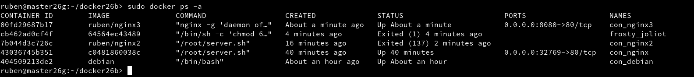

# **Docker**

## **1.- Contenedores con Docker**

Es muy común que nos encontremos desarrollando una aplicación, y llegue el momento que decidamos tomar todos sus archivos y migrarlos, ya sea al ambiente de producción, de prueba, o simplemente probar su comportamiento en diferentes plataformas y servicios.
Para situaciones de este estilo existen herramientas que, entre otras cosas, nos facilitan el embalaje y despliegue de la aplicación, es aquí donde entra en juego los contenedores (Por ejemplo Docker o Podman).
Esta herramienta nos permite crear "contenedores", que son aplicaciones empaquetadas auto-suficientes, muy livianas, capaces de funcionar en prácticamente cualquier ambiente, ya que tiene su propio sistema de archivos, librerías, terminal, etc.

Docker es una tecnología contenedor de aplicaciones construida sobre LXC.

## **2.- Instalación y primeras pruebas**

## **2.1.- Habilitar el acceso a la red externa a los contenedores**

Primero de todo, deberemos habilitar el reenvío de IPv4.

Vamos a Yast, ajustes de red y encaminamiento.


## **2.2.- Instalación**

Ejecutamos como super usuario: `zypper in docker` para instalar Docker.


`systemctl start docker` para iniciar el servicio.


`docker version` para comprobar la version.


## **2.3.- Primera prueba**

Deberemos tener al usuario normal incluido en el grupo *docker*.


Ahora ejecutaremos `docker images` para ver las imágenes descargadas hasta ahora (aún no debe haber ninguna).


`docker ps -a` para mostrar todos los contenedores creados, y al igual que con las imagenes, no debe haber ninguno.


`docker stop IDCONTENEDOR` para el contenedor.

`docker rm IDCONTENEDOR` elimina el contenedor.

`docker run hello-world`: Descarga una imagen "hello-world", crea un contenedor y ejecuta la aplicación que hay dentro.

Podemos ejecutar los comandos anteriores para comprobar que vamos bien hasta ahora.


## **3.- Creación manual de nuestra imagen**

## **3.1.- Crear un contenedor manualmente**

Primero descargaremos una imagen usando `docker search debian`, comando con el que buscamos en los repositorios Docker Hub contenedores con la etiqueta "debian".


`docker pull debian`: descargamos una imagen el local.


`docker images`: comprobamos que se ha descargado.


Ahora vamso a crear un contenedor de conbre "con_debian" a partir de la imagen debian y ejecutaremos el programa "/bin/bash" dentro del contenedor:

Lanzamos el siguiente comando: `docker run --name=con_debian -i -t debian /bin/bash`


## **3.2.- Personalizar el contenedor**

Ahora, dentro del contenedor, lo personalizaremos a nuetro gusto.

Instalar aplicaciones dentro del contenedor.

```
root@IDContenedor:/# cat /etc/motd            # Comprobamos que estamos en Debian
root@IDContenedor:/# apt-get update
root@IDContenedor:/# apt-get install -y nginx # Instalamos nginx en el contenedor
root@IDContenedor:/# apt-get install -y vim   # Instalamos editor vi en el contenedor
```


Crear un fichero HTML "holamundo.html".

```
root@IDContenedor:/# echo "<p>Hola nombre-del-alumno</p>" > /var/www/html/holamundo.html
```


Crear un script "/root/server.sh" con el siguiente contenido.

```
#!/bin/bash
echo "Booting Nginx!"
/usr/sbin/nginx &
echo "Waiting..."
while(true) do
  sleep 60
done
```


Recordar asignarle permisos de ejecución al script.


## **3.3.- Crear una imagen a partir del contenedor**

Abrimos otra terminal y ejecutamos el siguiente comando para crear una imagen a partir del contenedor elegido en el comando.

`docker images` para comprobar.


## **4.- Crear contenedor a partir de nuestra imagen**

## **4.1.- Crear contenedor con Nginx**

Ejecutamos `docker run --name=con_nginx1 -p 80 -t ruben/nginx1 /root/server.sh`, para iniciar el contenedor a partir de la imagen anterior.


## **4.2.- Comprobación**

Abrimos otra terminal y ejecutamos `docker ps` para ver los contenedores en ejecución


Accedemos por un navegador para comprobar el acceso.


Abrir navegador web y poner URL `0.0.0.0.:PORT`. De esta forma nos
conectaremos con el servidor Nginx que se está ejecutando dentro del contenedor.


Paramos el contenedor y lo eliminamos.


## **4.3.- Migrar la imagen a otra máquina**

¿Cómo puedo llevar los contenedores Docker a un nuevo servidor?

Exportar imagen Docker a fichero tar:

`docker save -o ~/alumnoXX.tar nombre-alumno/nginx1`, guardamos la imagen
"nombre-alumno/server" en un fichero tar.


Intercambiar nuestra imagen exportada con la de un compañero de clase.
Importar imagen Docker desde fichero:
Coger la imagen de un compañero de clase.
Nos llevamos el tar a otra máquina con docker instalado, y restauramos.
`docker load -i ~/alumnoXX.tar`, cargamos la imagen docker a partir del fichero tar.
`docker images`, comprobamos que la nueva imagen está disponible.
Ya podemos crear contenedores a partir de la nueva imagen.

## **5.- Dockerfile**

## **5.1.- Preparar ficheros**

Primero vamos a crear el directorio `/home/nombre-alumno/dockerXXa`.


Entramos al directorio y ponemos una copia de los ficheros `holamundo.html` y `server.sh` anteriores y creamos un fichero adicional llamado `Dockerfile` con el siguiente contenido:

```
FROM debian
MAINTAINER nombre-del-alumnoXX 1.0
RUN apt-get update
RUN apt-get install -y apt-utils
RUN apt-get install -y nginx
COPY holamundo.html /var/www/html
RUN chmod 666 /var/www/html/holamundo.html
COPY server.sh /root/server.sh
RUN chmod 755 /root/server.sh
EXPOSE 80
CMD ["/root/server.sh"]
```


## **5.2.- Creamos imagen a partir del fichero Dockerfile**

El fichero Dockerfile contiene toda la información necesaria para construir el contenedor, veamos:
* `cd dockerXXa`, entramos al directorio con el Dockerfile.
* `docker build -t nombre-alumno/nginx2 .`, construye una nueva imagen a partir del Dockerfile. OJO: el punto final es necesario.


* `docker images`, ahora debe aparecer nuestra nueva imagen.


## **5.3.- Crear contenedor y comprobar**

A continuación vamos a crear un contenedor con el nombre `con_nginx2`, a partir de la imagen `ruben/nginx2`. Probaremos con:

`docker run --name=con_nginx2 -p 8080:80 -t nombre-alumno/nginx2`


Desde otra terminal ejecutamos los comandos necesarios para averiguar el puerto de escucha del servidor Nginx.


## **5.4.- Usar imaganes ya creadas**

Creamos el directorio `docker26b`.


Creamos otro `Dockerfile` con el contenido que se muestra en la siguiente captura:


Ejecutamos los siguientes comandos:


Y comprobamos desde el navegador.


## **6.- Limpiar contenedores e imágenes**




