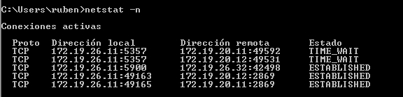
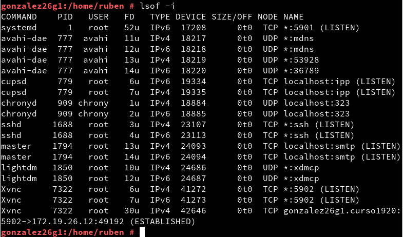

# Actividad VNC

* Comprobacion Windows



* Comprobacion Linux



```
Las IP's asignadas no son las mismas que aparecen en la rúbrica, la tabal de las IP's se subió despues de asignar las direcciones a las máquinas.
```
